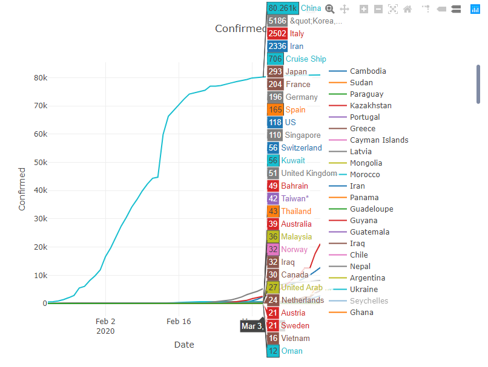

# COVID-19 Prediction and Visualization Software

## Software plots public data of the Corona (Covid-19) virus.

### Plot examples:
#### Configs: with country filter!
|  |  |  |
| ------------------------------------------------------------------------------------- | ------------------------------------------------------------------------------------- | ------------------------------------------------------------------------------------- |

##### Configs: *without* country filter!
|  |  |  | 
| ------------------------------------------------------------------------------------- | ------------------------------------------------------------------------------------- | ------------------------------------------------------------------------------------- |

##### Hover:


### Code examples:
[Confirmed-Rate] Predict 10 day statistic for country: Germany.
```java
TimeSeriesDataPacket packet = this.getPacket("Germany", confirmedPackets);
System.out.println(packet);
assert packet != null;
this.predict(this.extractData(packet));
```
[Death-Rate] Predict 10 day statistic for country: Germany.
```java
TimeSeriesDataPacket packet = this.getPacket("Germany", deathPackets);
System.out.println(packet);
assert packet != null;
this.predict(this.extractData(packet));
```